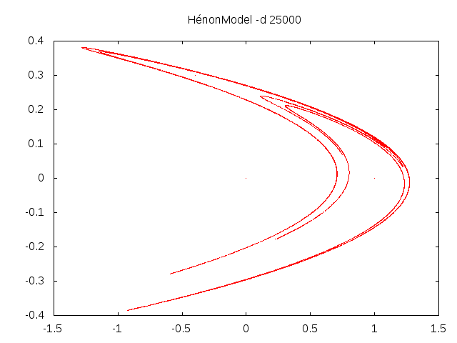

The Hénon Map
=============

A [Hénon map](https://en.wikipedia.org/wiki/H%C3%A9non_map)
is a discrete-time dynamical system described by the following
equations:

$$
\begin{aligned}
x_{t+1} &= 1 - ax_t^2 + y_t \\
y_{t+1} &= bx_t
\end{aligned}
$$

It is a simple example of the use of the *DiscreteProcess* class and
is implemented in the
[Henon.scala](https://github.com/edinburgh-rbm/mois-examples/blob/master/src/main/scala/uk/ac/ed/inf/mois/examples/Henon.scala)
file as follows just like this:


import uk.ac.ed.inf.mois.MoisMain
import uk.ac.ed.inf.mois.DiscreteProcess

case class Hénon(a: Double, b: Double) extends DiscreteProcess("Henon") {
  val x = Double("ex:x")
  val y = Double("ex:y")
  n(x) := 1.0 - a * x*x + y
  n(y) := b * x
}

object HénonModel extends MoisMain("Hénon Model") {
  val model = new Hénon(1.4, 0.3)
}


The $n(x)$ operator denotes the value of $x$ at the next time, that is
at $t+1$.

Running the model for 25000 time steps and graphing the output produces:

