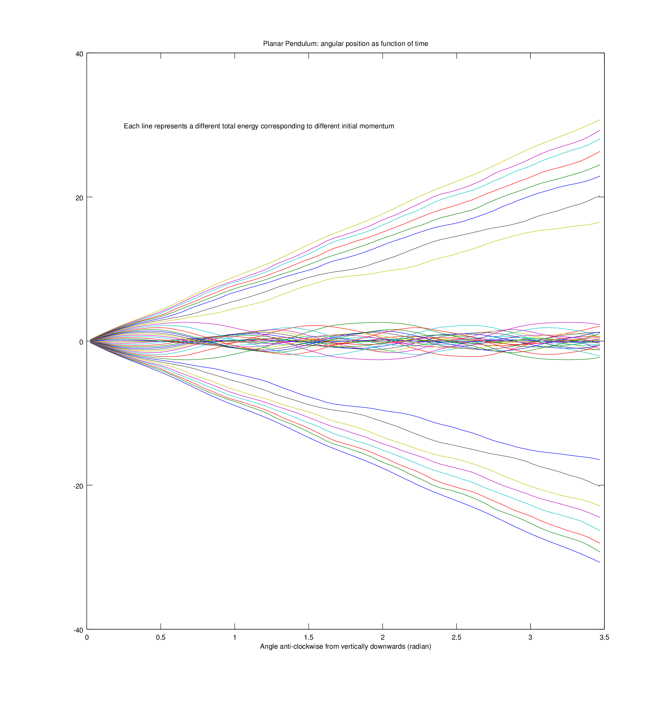

NetCDF output and processing
============================

[NetCDF] is a format for expressing multidimensional arrays of
numerical data. It is commonly used in geosciences and climate
modelling but is well suited to any sort of timeseries or gridded
data. There is extensive documentation on the [NetCDF] web site but
here we will look at how to make mois produce such files and some
simple ways of processing them with [GNU Octave] and [Matlab].

Our example will be the [planar pendulum] model. To write the file we
simply run the model like this:

~~~~~
sbt> run model -d 10 -o netcdf:pendulum.nc Pendulum
~~~~~

This produces the file [pendulum.nc](pendulum.nc).

[NetCDF]: http://www.unidata.ucar.edu/netcdf
[GNU Octave]: https://gnu.org/software/octave/
[Matlab]: http://www.mathworks.co.uk/products/matlab/
[planar pendulum]: ../pendulum
