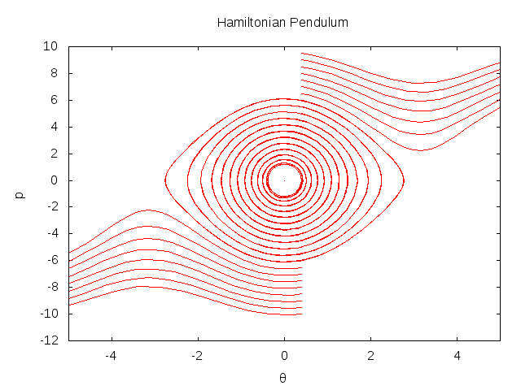
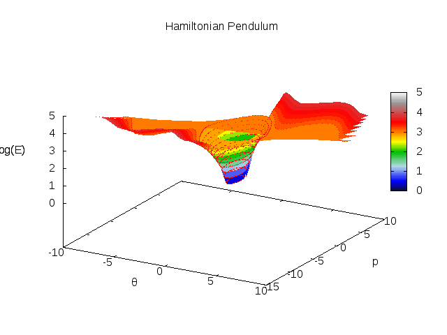

Hamiltonian Pendulum
====================

This example shows how to create processes using a Hamiltonian. It
follows
[this paper](https://www.wiki.ed.ac.uk/download/attachments/215188561/MPT%20Series%20-%20Session%204-%20Addendum.pdf?version=1&modificationDate=1404399118000&api=v2)
that gives treatments of the simple planar pendulum using the
Newtonian, Lagrangian and Hamiltonian methods.

In the hamiltonian case, we have

$$
H(\theta, p_\theta) = \frac{p_\theta^2}{2ml^2} + mgl(1 - cos(\theta))
$$

The process itself consists in just declaring the variables and
defining the Hamiltonian as follows


import uk.ac.ed.inf.mois.{HamiltonianProcess, Math, Model}

/**
 * The Planar Pendulum is parametrised by two variables,
 * the mass and length of the pendulum.
 */
class Pendulum(m: Double, l: Double) 
     extends HamiltonianProcess("Planar Pendulum") with Math {
  // declare the variables
  val θ = Double("ex:θ")
  val p = Double("ex:p")
  // a constant
  val g = 9.81

  // Define the Hamiltonian
  H(θ)(p) := pow(p,2)/(2*m*pow(l,2)) + m*g*l*(1 - cos(θ))
}


The function to define the Hamiltonian takes two lists of variables -
one each for the generalised coordinates and conjugate momenta. In
this case we have one coordinate, $\theta$ which is the angle from
vertical of the pendulum, and $p_\theta$ the corresponding angular
momentum.

Creating the model is slightly more involved than some of the other
examples because in order to make a phase-space diagram we need to run
the it several times with different initial conditions.


class PendulumModel extends Model {
  // set up the model parameters
  val m = Double("ex:m") := 1 // unit mass
  val l = Double("ex:l") := 1 // unit length

  // create a pendulum process
  val process = new Pendulum(m, l)

  // bring θ and p into scope so we can change their values
  import process._

  // The run method of MoisMain will normally only run
  // the model once. We want to run it several times
  // for different initial momenta
  override def run(t: Double, tau: Double) {
    // run in steps of 0.5 momentum from -10 to 10
    for(i <- (-20 until 20 by 1).map(_.toDouble/2)) {
      // start at pi/8 from the vertical
      θ := PI/8
      // set the initial momentum
      p := i
      // reset the output handler to produce a blank
      // line in the output file for gnuplot
      reset(t)
      // run the model
      process(t, tau)
    }
  }
}


And so we get these diagrams with gnuplot, clearly showing the
oscillating pendulum in the central area where the circles are - each
line is a path of constant energy, each corresponding to a run of the
simulation with a different initial momentum. Outside the circular
area the pendulum has too much energy to stop and instead circulates
instead of oscillating back and forth.

The complete version of the model, which uses
[annotations](../annotation.html) and [post-hoc
calculations](../varcalc) to transform back to cartesian coordinates
can be seen in the [github
repository](https://github.com/edinburgh-rbm/mois-examples/blob/master/src/main/scala/uk/ac/ed/inf/mois/examples/Pendulum.scala)

