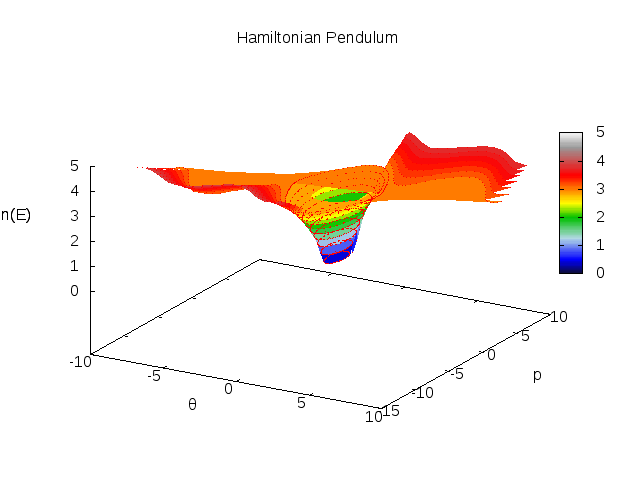

Hamiltonian Pendulum
====================

This example shows how to create processes using a Hamiltonian. It
follows
[this paper](https://www.wiki.ed.ac.uk/download/attachments/215188561/MPT%20Series%20-%20Session%204-%20Addendum.pdf?version=1&modificationDate=1404399118000&api=v2)
that gives treatments of the simple planar pendulum using the
Newtonian, Lagrangian and Hamiltonian methods.

In the hamiltonian case, we have

$$
H = \frac{p_\theta^2}{2ml^2} + mgl(1 - cos(\theta))
$$

The process itself consists in just declaring the variables and
defining the Hamiltonian as follows


/**
 * The Planar Pendulum is parametrised by two variables,
 * the mass and length of the pendulum.
 */
case class Pendulum(m: Double, l: Double) 
     extends HamiltonianProcess("Pendulum") {
  // declare the variables
  val θ = Double("ex:θ")
  val p = Double("ex:p")
  // a constant
  val g = 9.81

  // Define the Hamiltonian
  H(Seq(θ), Seq(p)) := (p*p)/(2*m*l*l) + m*g*l*(1 - cos(θ))
}


The function to define the Hamiltonian takes two lists of variables -
one each for the generalised coordinates and conjugate momenta. In
this case we have one coordinate, $\theta$ which is the angle from
vertical of the pendulum, and $p_\theta$ the corresponding angular
momentum.

  The syntax could be a little cleaner!

Creating the model is slightly more involved than some of the other
examples because in order to make a phase-space diagram we need to run
the it several times with different initial conditions.


object PendulumModel extends MoisMain("Pendulum Model") {
  // create a pendulum model with unit mass and unit length       
  val model = new Pendulum(1, 1)
  import model._

  // The run method of MoisMain will normally only run
  // the model once. We want to run it several times
  // for different initial momenta
  override def run(t: Double, tau: Double) {
    // run in steps of 0.5 momentum from -10 to 10
    for(i <- (-20 until 20 by 1).map(_.toDouble/2)) {
      // start at pi/8 from the vertical
      θ := PI/8
      // set the initial momentum
      p := i
      // reset the output handler to produce a blank
      // line in the output file for gnuplot
      outputHandler.reset(t, model)
      // run the model
      model(t, tau)
    }
  }
}


