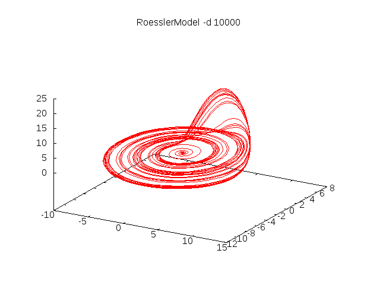

The Rössler Attractor
=====================

A [Rössler attractor](https://en.wikipedia.org/wiki/R%C3%B6ssler_attractor)
is generated by the following system of differential equations:

$$
\begin{aligned}
\frac{dx}{dt} &= -y - z \\
\frac{dy}{dt} &= x + ay \\
\frac{dz}{dt} &= b + z(x - c) \\
\end{aligned}
$$

It is a simple example of the use of the [ODE] class and
is implemented in the
[Roessler.scala](https://github.com/edinburgh-rbm/mois-examples/blob/master/src/main/scala/uk/ac/ed/inf/mois/examples/Roessler.scala)
file as follows just like this:


import uk.ac.ed.inf.mois.Model
import uk.ac.ed.inf.mois.ODE

class Roessler(a: Double, b: Double, c: Double) extends ODE("Roessler") {
  val x = Double("ex:x")
  val y = Double("ex:y")
  val z = Double("ex:z")
  d(x) := -y - z
  d(y) := x + a*y
  d(z) := b + z * (x - c)
}

class RoesslerModel extends Model {
  val Double("ex:a") := 0.2
  val Double("ex:b") := 0.2
  val Double("ex:c") := 5.7
  val process = new Roessler(a, b, c)
}


The $d(x)$ operator, which may also be written as $d(x)/dt$ denotes
the time derivative of $x$ with respect to $t$ as might be supposed.

Running the model for 1000 time steps and graphing the output with
gnuplot produces:

[ODE]: https://edinburgh-rbm.github.io/mois/api/current/#uk.ac.ed.inf.mois.ODE
