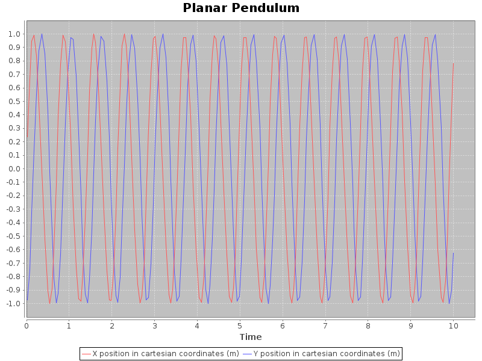

Running Models
==============

A simulation is run in one of two ways. For both ways, a Java Runtime
Environment is required as is the 
[Scala Build Tool](http://www.scala-sbt.org). *sbt* is used to run the
simulation.

Pre-packaged models
-------------------

If the model is in some sense "finished" and has been published to
one of the standard binary class repositores such as 
[Maven Central](http://mvnrepository.com/), no extra software is
necessary to run it, only the *.properties* file that instructs
*sbt* where to get it is needed. An example *.properties* file
looks like
[this](https://github.com/edinburgh-rbm/mois-examples/blob/master/examples/mois-examples.properties).
It can then be downloaded and run like so:

~~~~~
% sbt @mois-examples.properties
Getting uk.ac.ed.inf mois-examples_2.11 1.99.3-SNAPSHOT ...
downloading ...
...
Error: Must specify a command
mois 1.99.3-SNAPSHOT
Usage: mois [info|list|model] <args>...

Command: info <model>
Get information on a model
  <model>
        Model name

Command: list
List models

Command: model [options] <model>
Run a model
  -d <value> | --duration <value>
        Simulation duration (mandatory)
  -b <value> | --begin <value>
        Simulation start time (default: 0.0)
  -i <value> | --initial <value>
        Initial conditions filename (JSON)
  -s <value> | --state <value>
        Dump state at end of simulation
  -o <value> | --output <value>
        Output specification
  <model>
        Model name

Allowed output specifications:
	gui[:vars...]		Simple plot to a graphical window.
	netcdf:<file>		NetCDF output to the given file
	png:<file>[:vars...]	Simple plot to a PNG file
	tsv			Tab-separated values to standard output
	tsv:<file>		Tab-separated values to the given file
~~~~~

The helpful message displayed says that you must tell the program what
to do! At the time of writing, three commands are supported.

   * `list` prints a list of available models
   * `info` takes a model as argument and prints out detailed
     information about it
   * `model` runs the model and requires at least a `--duration`

Let's go ahead and try these.

~~~~~
% sbt @mois-examples.properties list
Known models:
	uk.ac.ed.inf.mois.examples.BollenbachModel
	uk.ac.ed.inf.mois.examples.HénonModel
	uk.ac.ed.inf.mois.examples.PendulumModel
	uk.ac.ed.inf.mois.examples.PySpiralModel
	uk.ac.ed.inf.mois.examples.RoesslerModel
	uk.ac.ed.inf.mois.examples.SampleODEModel
~~~~~

Suppose we would like more information about the Pendulum model. It
isn't necessary to type out the whole long name, just enough to make
it unambiguous ("Pe" would be minimally sufficient in this case, but
"P" would not because it would also match the python spiral model":

~~~~~
% sbt @mois-examples.properties info Pendulum
model parameters:
    Double(p0) := -10.0
    Int(n) := 41
    Double(θ0) := 0.0
    Double(p_delta) := 0.5
    Double(m) := 1.0
    Double(l) := 1.0
process tree:
            mass: 1.0
            type: Hamiltonian
          length: 1.0
            name: Pendulum
   mois-examples: 1.99.3-SNAPSHOT
           title: Planar Pendulum
           class: uk.ac.ed.inf.mois.examples.Pendulum
            mois: 1.99.3-SNAPSHOT
       variables:
          Double(y) := -1.0
                           units: m
                       long_name: Y position in cartesian coordinates
          Double(E) := 0.0
                           units: J
                       long_name: Total energy
          Double(θ) := 0.0
                           units: rad
                       long_name: Angle anti-clockwise from vertically downwards
          Double(x) := 0.0
                           units: m
                       long_name: X position in cartesian coordinates
          Double(p) := 0.0
                           units: J.s
                       long_name: Angular momentum
~~~~~

To actually run a model, and show a graph of the last few datapoints
for the *x* and *y* variables during execution, or alternatively write
a plot out as an image, one could then do

~~~~~
% sbt @mois-examples.properties model --duration 10 -o gui:x,y Pendulum
% sbt @mois-examples.properties model --duration 10 \
    -o png:pendulum-xy.png Pendulum
~~~~~

Which produces this image:

Developing and Modifying Models
-------------------------------

The other way is to obtain a copy of the source code and run *sbt* on
its own. From the interactive shell it is possible to simply use the
*run* command, with arguments as above:

~~~~~
% sbt 
> run model --duration 10 --output gui Pendulum
[info] Updating {file:.../mois-examples/}mois-examples...
[info] Resolving jline#jline;2.11 ...
[info] Done updating.
[info] Compiling 4 Scala sources to .../mois-examples/target/scala-2.11/classes...
[info] Running uk.ac.ed.inf.mois.MoisMain model --duration 10 --output gui Pendulum
[success] Total time: 5 s, completed Jul 8, 2014 10:53:57 PM
>
~~~~~

This way of running the simulation is useful while the model is being
developed because it will automatically recompile any source code
files that have been changed before actually running. 
